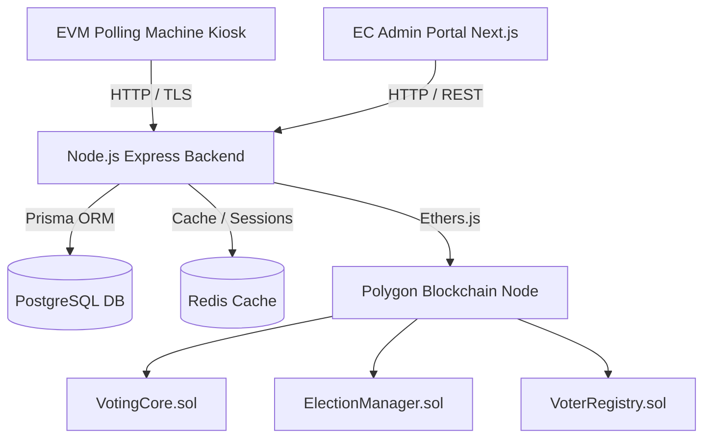

# VoteChain EVM - Production Electronic Voting System

VoteChain EVM is an enterprise-grade, decentralized electronic voting platform powered by Polygon/Ethereum smart contracts, Node.js backend services, Next.js administration portals, and Electron EVM kiosk software.

---

## 🏛 System Architecture Overview



---

## 🚀 Quick Start (Local Development)

### Prerequisites
- Node.js `v20+`
- `pnpm` `v8+`
- Docker & Docker Compose

### 1. Environment Setup
Clone the repo and configure environment files:
```bash
cp .env.example .env
make setup
```

### 2. Launch Local Infrastructure Stack
Start Postgres, Redis, IPFS, and Prometheus:
```bash
make docker-up
```

### 3. Smart Contract Deployment
Deploy UUPS proxy smart contracts to Hardhat local network:
```bash
make deploy-contracts
```

### 4. Database Seed & Backend Launch
Migrate PostgreSQL database, seed initial data, and run dev servers:
```bash
make db-seed
make dev
```

---

## 🔒 Security Principles
- **No Voter Tracking**: Voter identity hashes are decoupled from candidate selection votes on-chain.
- **Multisig Certification**: Results require 3-of-5 Election Commission signatures to achieve certification state.
- **Hardware Machine Tokens**: Polling kiosk EVM software requires cryptographically signed session tokens.

---

## 📜 License
Licensed under the MIT License.
